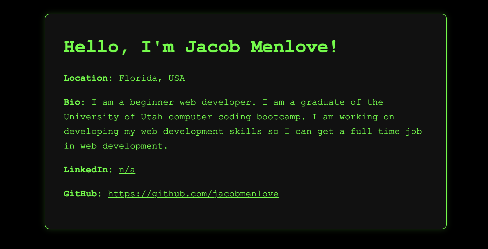

# 🧑‍💻 Portfolio Generator (Terminal Edition)

A command-line application that generates a personalized, retro-styled HTML portfolio page using user input. Inspired by classic green-screen terminals, this tool is perfect for developers who want a nostalgic and minimalist profile page.

---

## 🚀 Features

- Prompts user for name, location, bio, LinkedIn, and GitHub
- Automatically generates a fully formatted HTML portfolio
- Applies a terminal-style black and green color scheme
- Outputs a mobile-friendly, responsive layout
- Uses modern tools like `inquirer` and Node’s `fs` module

---

## 📸 Preview

>   
> _Here’s a preview of the terminal-style portfolio page generated by this tool._
---

## 📁 File Structure

portfolio-generator/
├── output/ # Where the generated HTML file is saved
│ └── portfolio.html
├── templates/
│ └── style.css # External CSS with terminal-themed styling
├── index.js # Main CLI application logic
├── package.json # npm config and dependencies
└── README.md # Project overview and usage

yaml
Copy code

---

## 🛠️ Tech Stack

- [Node.js](https://nodejs.org/)
- [Inquirer](https://www.npmjs.com/package/inquirer)
- [fs (Node File System)](https://nodejs.org/api/fs.html)
- HTML & CSS (terminal-style design)

---

## 📦 Installation

1. **Clone the repository**
   ```bash
   git clone https://github.com/jacobmenlove/portfolio-generator.git
   cd portfolio-generator
Install dependencies

bash
Copy code
npm install
Run the application

bash
Copy code
node index.js
follow the instructions in your terminal
View your portfolio

Open output/portfolio.html in your browser

✏️ Customization Tips
Modify templates/style.css to change the layout or color scheme

Add more prompts (e.g. skills, projects, contact info)

Improve layout with sections or animations

Add logic to validate URLs or input format

📄 License
This project is open-source and free to use under the MIT License.

🙌 Acknowledgments
Created as part of a learning challenge to practice:

CLI tools

Node.js fundamentals

Template literals

External CSS and file I/O

Shoutout to the retro computing community for inspiring the theme 💾